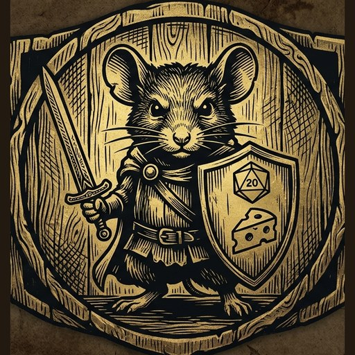
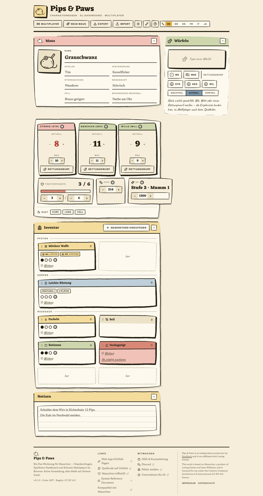
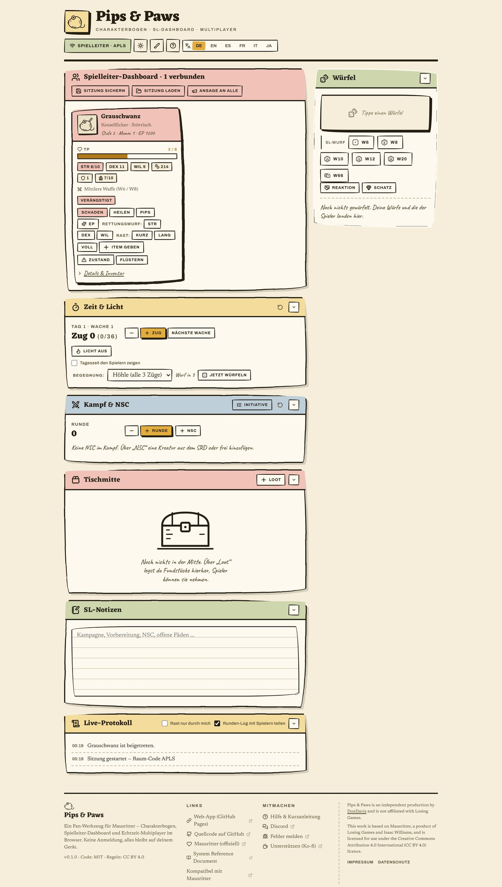
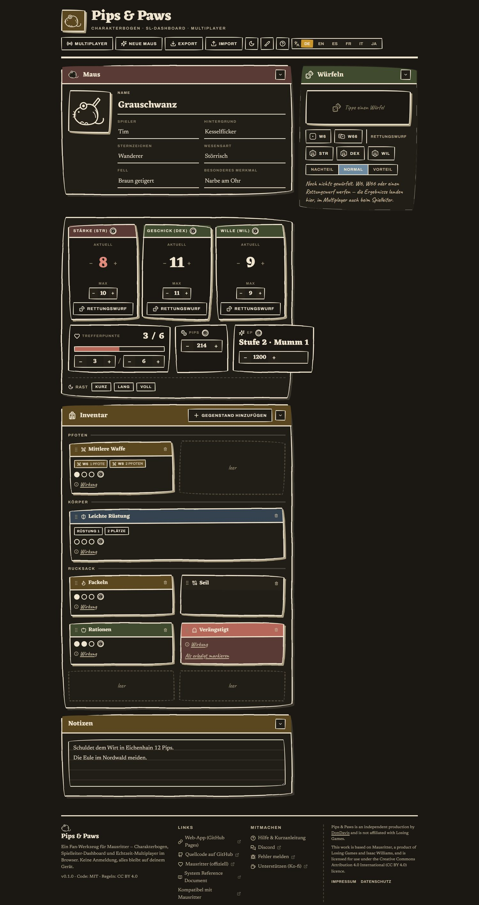

<div align="center">



# Pips &amp; Paws

**Character sheet · GM dashboard · serverless real-time multiplayer**
for the **Mausritter** tabletop RPG — all in the browser, no sign-up.

### ▶ [dondavis-vibe.github.io/pips-and-paws](https://dondavis-vibe.github.io/pips-and-paws/)

<sub>English · German · French · Italian · Japanese — everything stays local in your browser, no account, no server</sub>

<sub><a href="README.de.md">Deutsche Version →</a></sub>

</div>

<p align="center">
  
  
</p>

---

Open the site, roll up a mouse, and go. To play together, the GM opens a room and
shares a link — the connection runs directly between browsers (WebRTC), with no
data passing through the operator's server.

## For players

- **Character sheet** — STR / DEX / WIL (current & max), Hit Protection, Pips, XP,
  Grit, a portrait and notes. Everything autosaves in the browser.
- **Character creation to SRD 2.3.1** — 3d6 (keep the two highest), HP & Pips at 1d6
  each, the full 36-entry background table with starting gear, the weak-mouse rule,
  birthsign · coat · detail.
- **Drag-and-drop inventory** — two paws, two body, six pack; 1- and 2-slot items,
  swapping, usage dice, conditions as cards. Every item has an icon you can change.
- **Dice** — d6 and d66 roll as real tumbling 3D cubes; saves (d20 ≤ attribute) with
  advantage / disadvantage. Clicking a weapon's damage value rolls it (one-paw and
  two-paw separately). Every roll shows up in the dice panel.
- **Automatic damage chain to SRD** — STR damage triggers a STR save on the spot;
  fail it and the mouse is Injured and incapacitated until it rests. Hit 0 STR and
  it dies — the app never deletes or locks anything on its own, it just says so.
- **Rest helper** — short / long / full, with ration use and attribute healing by
  the book; any rest also clears "incapacitated".
- **Hirelings** — hire from the SRD's catalogue (torchbearer, mercenary, scholar, …),
  stats roll themselves on the spot, morale saves stay local to your sheet.
- **Multiple mice per browser** — every mouse you've played is kept in a roster you
  can switch back to, no manual saving needed.

## For GMs

- **Dashboard** — every hero at a glance: portrait, HP, scores, armour, filled
  slots, weapons, conditions.
- **Per-mouse actions** — damage, heal, pips, XP, trigger a rest, call for a save
  or initiative, whisper, announce to all, give an item or a condition.
- **Dice panel** with a result stage, reaction and treasure rolls, and a roll log
  that also shows the players' rolls.
- **Shared table** — a common loot drop; items can be prepared and hidden from the
  players until they're "on the table".
- **Time & light** — turn / watch / day counter, torch and encounter countdowns,
  an alarm banner on an encounter or omen, an optional time-of-day readout for the
  players.
- **NPC & combat tracker** — creatures from the SRD or your own, attack and morale
  rolls in one click, individual NPCs toggled visible to the players.
- **Save & load a session**, plus general notes.
- **Play at the table without extra devices** — create or load characters right in
  the dashboard, run damage/heal/rest/items/conditions on them directly, and open
  the full sheet full-screen to hand the device around.
- **Soundboard** — built-in stingers (success/fail/critical/fumble/bell — free
  CC0 sounds from [Kenney.nl](https://kenney.nl/assets/interface-sounds), see
  `src/assets/sfx/CREDITS.txt`) plus your own uploaded ambience/music (stays on
  your device, sent live to whoever's connected).

## Playing together

- **Serverless multiplayer** over WebRTC / PeerJS. The GM is the host; players join
  with a 4-character code or a `?join` link. Reconnect and reload recovery are
  built in.
- **Shared round log** — the GM opens it up, then every player sees the round's
  rolls and events on their own sheet. Players' rolls always reach the GM regardless.
- **Optional Discord webhook** — mirrors rolls and events into a channel. The URL
  lives in `localStorage` only, never in the character file.
- **Group overview** — the GM can share a compact view of the party (name, HP,
  conditions) so players see each other, not just their own sheet.

## Look & feel

The default look is a **printed sheet**: ink on paper, thick hand-drawn rules,
flat spot colours, handwritten margin notes and a "negative print" dark mode.
Every line drawing (the mouse, the portrait placeholder, the empty-state
vignettes) is an inline SVG, no stock icons for the brand. The previous app
look is still there as **Classic** — the brush button in the header switches
between the two, the choice is remembered.

## Also

Collapsible panels (state remembered) · light / dark toggle (Classic has its
own background image per mode) · a dice panel that sticks in view on wide
screens · JSON export / import of the sheet · runs offline from a single file.

<details>
<summary>Dark mode</summary>



</details>

## Develop

```bash
npm install
npm run dev        # http://localhost:5173
npm run build      # -> dist/index.html  (one portable file, viteSingleFile)
npm run preview
npm run lint       # oxlint
```

A push to `main` builds and deploys via GitHub Actions to GitHub Pages.

**Stack:** Vite + React 19 (plain JS, no TypeScript), `@dnd-kit` for the inventory
grid, `peerjs` for multiplayer, `lucide-react` for icons. No backend, no account.

**Styling:** `src/theme.css` is the Classic look and carries all layout; it sits in
`@layer classic`. `src/print.css` is the default print-sheet look — unlayered and
scoped to `html[data-skin="print"]`, so it overrides only colours, borders, fonts
and shadows, never grid/flex structure. Line art lives in `src/components/Art.jsx`.

## Contributing

Pull requests are welcome — translations especially. The UI ships in English,
German, Spanish, French, Italian and Japanese. Spanish was contributed by
[@Salgraphics](https://github.com/Salgraphics); FR/IT/JA are machine-assisted, so
corrections from native speakers are very welcome. Keys added after the Spanish
PR (local play, soundboard, group overview, the print-sheet skin, hirelings, the
character roster, the automatic damage chain) are deliberately left untranslated
in `es.json` — they fall back to English — so
that gap stays open for a native speaker rather than getting pre-filled by a
machine translation. The flow and the steps for a new language are in
[`CONTRIBUTING.md`](CONTRIBUTING.md).

## Rules data & images

`src/data/*` is derived from the official **Mausritter SRD 2.3.1** (CC BY 4.0).
Effect texts are summarised, not copied verbatim. The free PDFs under `reference/`
are kept local only (their artwork is not CC BY, excluded via `.gitignore`).

The crest, background images, vignettes and portrait placeholder are derived from
my own AI generations (sources in `img/`) — **not** official Mausritter artwork
and **not** a publisher logo.

The GM soundboard's built-in stingers (`src/assets/sfx/`) are from Kenney's
["Music Jingles"](https://kenney.nl/assets/music-jingles) and
["Interface Sounds"](https://kenney.nl/assets/interface-sounds) packs, licensed
[CC0](https://creativecommons.org/publicdomain/zero/1.0/) — see
`src/assets/sfx/CREDITS.txt`.

## Legal

The German [imprint &amp; privacy policy](https://dondavis-vibe.github.io/pips-and-paws/impressum.html)
is a single page (`public/impressum.html`), linked from the footer. The privacy
part describes the actual technical setup; update it if external services or
stored keys change. Anyone forking the code and hosting it themselves needs their
own imprint (see `CONTRIBUTING.md`).

## License

Code: **MIT** (`LICENSE`).

> *Pips &amp; Paws is an independent production by DonDavis and is not affiliated with Losing Games.*
>
> *This work is based on Mausritter, a product of Losing Games and Isaac Williams, and is
> licensed for use under the Creative Commons Attribution 4.0 International (CC BY 4.0) licence.*
